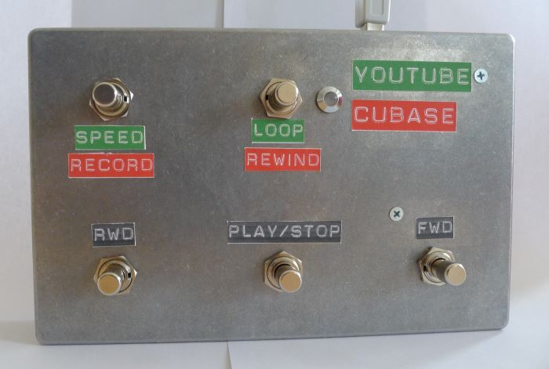
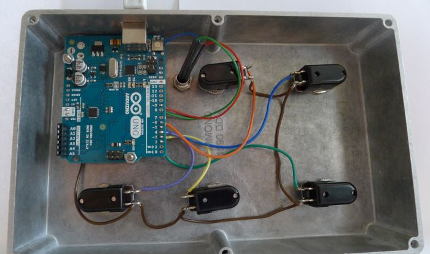

# Youtube controller



It's a pedal for musicians who want to control Youtube or Cubase by foot and keep their hands on the instrument.

Long press on the loop/rewind switch change preset between Youtube and Cubase.

## Youtube features

* play/pause
* go 5s back or forward
* reduce playback speed (click to cycle 75%, 50%, 100%)
* loop any section of the video (click to set start, end and delete the loop)

## Cubase features

* play/stop
* go back or forward
* start recording
* rewind to the start

# Hardware



* Arduino board
* 5 momentary switches
* 1 bi-color LED

Switch pins are in pull-up mode, switches are connected to the ground.

```
#define LED_GREEN 8  // youtube mode
#define LED_RED 9    // cubase mode
#define BUT1_PIN 2   // back
#define BUT2_PIN 3   // play / stop
#define BUT3_PIN 4   // forward
#define BUT4_PIN 5   // speed / record
#define BUT5_PIN 6   // loop / rewind - long press change mode
```

# Arduino software

## Arduino Uno

Install Hoodloader (https://github.com/NicoHood/HoodLoader2) on the board.

* Flash the 16u2 (usb micro-controller) with `youtube_controller_16u2.ino`.
* Flash the 328 with `youtube_controller_328.ino`

## Arduino (Leonardo, Esplora, Zero, Due and MKR Family)

Those board can control USB with the main chip, you should be able to replace the calls to `Serial1.write()` by `Keyboard.press()` ...

# Google Chrome extension

This extension allows the Loop button to make video loop with Youtube.

Without the hardware controller, loops can be created with the key 'y'.

## Install

Open the Extension Management page by navigating to chrome://extensions.

The Extension Management page can also be opened by clicking on the Chrome menu,hovering over More Tools then selecting Extensions.

Enable Developer Mode by clicking the toggle switch next to Developer mode.

Click the LOAD UNPACKED button and select the `youloop-chrome-extension` directory.


